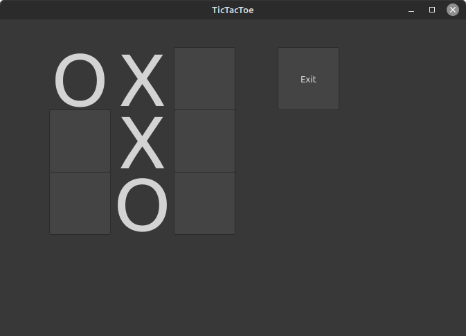
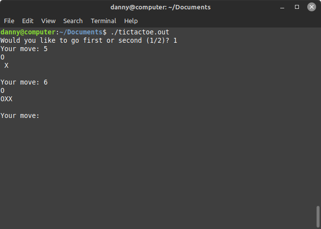

# tic-tac-toe
Tic Tac Toe with Qt framework GUI. Also includes a CLI version. The GUI version has so far only been tested working on Linux.

 

## How to compile (GUI, Linux)

1. Install Qt

2. `mkdir build && cd build`

3. `cmake ..`

4. `make`

The CLI version (tictactoe.c) has no external dependencies and can be compiled using your favourite C compiler. 